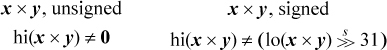

# Determining if multiplication will overflow

## Overview of Problem

When multiplying either unsigned numbers or signed 2's complement numbers, overflow occurs if the result cannot be held in the 32 bits commonly needed for an integer. The product of two 32-bit numbers, whether signed or unsigned, can be held in a 64-bit integer. Checking for overflow of multiplying two 32-bit numbers is possible if you have all 64 bits of the product. If we consider the higher 32 bits of the product of multiplying x by y as hi(x X y), and the lower 32 bits of the product as lo(x X y), then then **overflow has occurred for either unsigned or signed numbers when the following are true:**

In the above, for the case when x and y are signed, the small s above the >> indicates the signed arithmetic shift operation.

## Your goal

You will be creating two functions in a file called mult_overflow.c

    bool umult_ok(unsigned int x, unsigned int y)
    bool tmult_ok(int x, int y)
    
Each of these functions returns true if the multiplication of x and y will not result in overflow.

You will test these functions thoroughly in a file called test.c For this problem, **you must use asserts** for your tests. You can feel free to print in either .c file as you debug, but you will need to comment those or remove them and only use asserts to test.

You are given the Makefile.

## What you will build

    mult_overflow.c
    test.c
    
    
### What must work

To grade your work, we should be able to do the following at the terminal:

    make clean
    make
    ./check_mult_overflow
    
## Good Code Practice expected for every assignment

This information is on moodle, but repeated here.

One goal we have for computer science majors or other students who may develop code at some point in their lives is that they learn and practice good coding techniques. In this class, we do this by setting expectations for coding that mimic how you would write code in real life, as you try to make certain that it is correct, and that other developers who look at your code later will understand it because it is readable and has useful explanations of what it contains and how it works. It is essential that you develop habits of mind when coding that you use consistently for every task you take on.

To instill this habit of mind in your work, we insist that all homework code have the following properties:

- Code is indented properly.

- Code is broken into small functions that make sense as a separate entity.

- Code contains a main() that tests each function **thoroughly and exhaustively**. For this course, place that in a file called `test.c`  **Thorough and exhaustive** testing is harder than you might imagine but *really important*.  You must design tests of a function that try all ranges and extremes of possible values to ensure that it works in all possible cases.  Think this part through very carefully and explain the tests in comments.  Use asserts to help you check results instead of printing large amounts of output.  Having asserts in your code instead of print statements means that you can avoid the manual hassle of looking through large amounts of printout to check your code for accuracy. (In certain cases, printing is also useful; make a judgment for the code you are asked to test, and in some cases use both prints and asserts.)

- main() returns 0 when it completes successfully.

- There is a header comment in every file with your name in it and a short description.

- There is a header comment for **every function** describing its input parameters and what it returns.

- There are comments in main explaining the tests that you are running on each function.

- There are comments within functions when necessary to explain it. Not every line needs to be commented.